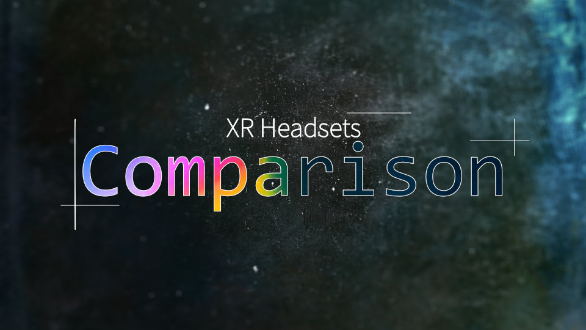

# XR ヘッドセット比較表

XR ヘッドセットを独断と偏見で比較するサイトです。  フィルタリングや、その結果をシェアすることも可能。

[サイトはこちら](https://xr-comparison.yutokun.com/)

## 貢献する方法について

本サイトに修正や情報提供をしたい場合、[Contribution Guide（日本語）](CONTRIBUTING.md) を参考にして下さい。

## クレジット

**株式会社IntoFree 西川 美優 様**

メーカー推奨年齢、発売状況を中心に、データの拡充に協力して下さいました。

## ライセンス

本リポジトリにはヘッドセットの画像やフォント、Web 用のライブラリが含まれています。
それらの権利はヘッドセットのメーカー、あるいはオリジナルのライセンスに従います。

### Anime.js

Copyright (c) 2019 Julian Garnier

[MIT License](https://github.com/juliangarnier/anime/blob/master/LICENSE.md)

### Google Fonts

"[Noto Sans JP](https://fonts.google.com/specimen/Noto+Sans+JP)" and "[Krub](https://fonts.google.com/specimen/Krub)" licensed under the SIL Open Font License

[Open Font License](http://scripts.sil.org/cms/scripts/page.php?site_id=nrsi&id=OFL_web)

### 上記以外

上記に含まれない HTML、文章、JavaScript、画像等のファイルは、[CC0](https://creativecommons.org/publicdomain/zero/1.0/) または [Unlicense](https://github.com/yutokun/XR-Headset-Comparison/blob/master/LICENSE.md) とします。

